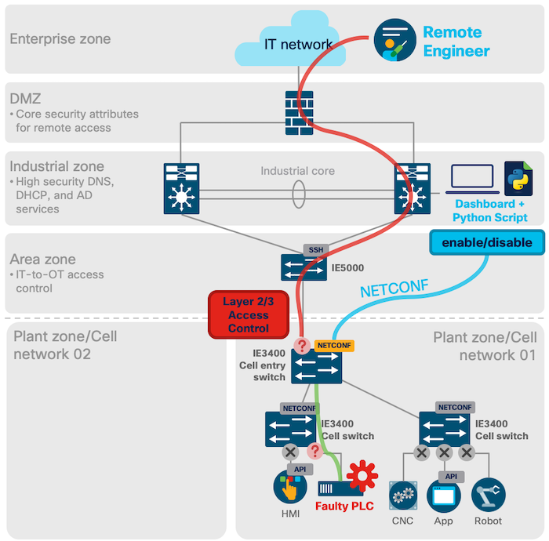

# Industrial Networking: Remote Access with ACLs and NETCONF

This is a simple example of how OT (Operational Technology) employees can enable or disable remote access (e.g. of a machine vendor) within their industrial network without any networking skills.

## Challenge

Remote access within an industrial network is a common challenge. It needs to be secure, reliable and easy to activate and deactivate which can be difficult to achieve.

## Solution

One possible part of an overall solution can be achieved with the help of NETCONF and Access Control Lists (ACLs). By simply defying a service as a python script which will execute pre-defined NETCONF commands to create, enable and disable ACLs on specific industrial hardware, for example the IE3400.

When you take a look at the architecture below, you can see that your python script can be located in the industrial zone and from there configure via NETCONF the ACLs.



## Example: IE3400 Northbound ACL

### Create the ACLs

At first, we create only the ACLs on our switch. We allow SSH (port 22) and NETCONF (port 830) access so that we still can configure the switch. And we allow as well access on port 80 to our faulty PLC which has the IP address 192.168.0.10. However the other connections will be denied.

```
config = '''
  <config xmlns="urn:ietf:params:xml:ns:netconf:base:1.0">
        <native xmlns="http://cisco.com/ns/yang/Cisco-IOS-XE-native">
            <ip>
                <access-list>
                    <extended xmlns="http://cisco.com/ns/yang/Cisco-IOS-XE-acl">
                        <name>remote-access</name>
                        <access-list-seq-rule>
                            <sequence>10</sequence>
                            <ace-rule>
                                <action>permit</action>
                                <protocol>tcp</protocol>
                                <any/>
                                <dst-any/>
                                <dst-eq>22</dst-eq>
                            </ace-rule>
                        </access-list-seq-rule>
                        <access-list-seq-rule>
                            <sequence>20</sequence>
                            <ace-rule>
                                <action>permit</action>
                                <protocol>tcp</protocol>
                                <any/>
                                <dst-any/>
                                <dst-eq>830</dst-eq>
                            </ace-rule>
                        </access-list-seq-rule>
                        <access-list-seq-rule>
                            <sequence>30</sequence>
                            <ace-rule>
                                <action>permit</action>
                                <protocol>tcp</protocol>
                                <any/>
                                <dst-host>192.168.0.10</dst-host>
                                <dst-eq>www</dst-eq>
                            </ace-rule>
                        </access-list-seq-rule>
                        <access-list-seq-rule>
                            <sequence>40</sequence>
                            <ace-rule>
                                <action>deny</action>
                                <protocol>ip</protocol>
                                <any/>
                                <dst-any/>
                            </ace-rule>
                        </access-list-seq-rule>
                    </extended>
                </access-list>
            </ip>
        </native>
    </config>
  '''
config_dict = xmltodict.parse(config)

netconf_reply = m.edit_config(target='running', config=config)
print("Did it work? {}".format(netconf_reply.ok))
```

The applied NETCONF configuration is equal to these **CLI commands**:

```
ip access-list extended remote-access
10 permit tcp any any eq 22
20 permit tcp any any eq 830
30 permit tcp any host 192.168.0.10 eq www
40 deny ip any any
```

### Enable & disable the ACLs on the Northbound Interface

Since our IE3400 is connected on the GigabitEthernet 1/3 interface to the IE5000 in this example, we enable or disable our created ACL on this interface.

If the user is selecting to enable remote-access, the configuration in `config` will be applied. If the user wants to disable it (selection `4` in the script), the configuration will be deleted as we add `operation="delete"`.

```
config = '''
  <config xmlns="urn:ietf:params:xml:ns:netconf:base:1.0">
        <native xmlns="http://cisco.com/ns/yang/Cisco-IOS-XE-native">
            <interface>
                <GigabitEthernet>
                    <name>1/3</name>
                    <ip>
                        <access-group>
                            <in>
                                <acl>
                                    <acl-name>remote-access</acl-name>
                                    <in/>
                                </acl>
                            </in>
                        </access-group>
                    </ip>
                </GigabitEthernet>
            </interface>
        </native>
    </config>
  '''
config_dict = xmltodict.parse(config)

if int(var) == 4:
  config_dict["config"]["native"]["interface"]["GigabitEthernet"]["ip"]["access-group"]["@operation"] = "delete"
  config = xmltodict.unparse(config_dict)

netconf_reply = m.edit_config(target='running', config=config)
print("Did it work? {}".format(netconf_reply.ok))
```

The applied NETCONF configuration is equal to this **CLI command**:

```
IE3400(int-config)#ip access-group remote-access in 
```

As you can see this is a powerful but easy way to change the configuration to your network. It can of course also be combined with a web-dashboard and Webex Teams (ChatOps).

## License

This project is licensed under the MIT License - see the [LICENSE.md](LICENSE.md) file for details

## Further Links

* [Cisco DevNet Website](https://developer.cisco.com)
* [Learning Labs: Industrial NetDevOps - Getting Started](https://developer.cisco.com/learning/modules/industrial-netdevops)
* [IR1101 DevNet Sandbox](https://devnetsandbox.cisco.com/RM/Diagram/Index/a2046279-a193-4d22-87b3-abcfee9569a6?diagramType=Topology)
* [IE3400 DevNet Sandbox](https://devnetsandbox.cisco.com/RM/Diagram/Index/097310ec-afbe-4e8b-8611-87fe2a087e1c?diagramType=Topology)